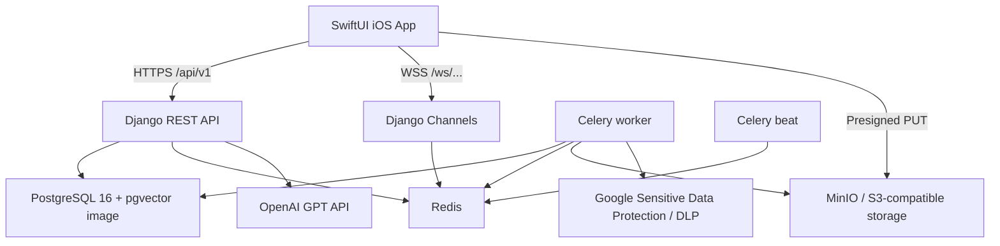

# CareBridge Architecture Plan

> Last updated: 2026-06-21
> Runtime target: local Docker Compose backend exposed through Cloudflare Tunnel when public device access is needed.

## Architecture Summary

CareBridge uses a SwiftUI iOS client with a Django 5 backend. The backend is containerized and runs on the user's computer, not on a managed cloud VM. Public iOS device testing is handled by Cloudflare Tunnel hostnames that forward HTTPS/WSS traffic to local Docker services.



## Runtime Services

| Service | Purpose |
|---|---|
| `web` | Django ASGI app served by Gunicorn + Uvicorn worker. Handles REST, SSE, and WebSocket entrypoints. |
| `db` | `pgvector/pgvector:pg16` PostgreSQL database. |
| `redis` | Cache, Django Channels layer, and Celery broker. |
| `minio` | S3-compatible object storage for receipts and documents. |
| `createbuckets` | One-shot MinIO bucket setup for local development. |
| `celery-worker` | Background de-identification, notifications, and async processing. |
| `celery-beat` | Scheduled tasks. Current schedule covers quarantine cleanup; medication reminders still need scheduling. |

## Backend Modules

| App | Responsibility |
|---|---|
| `apps.auth_account` | User model, JWT login/profile flows, join family, account deletion. |
| `apps.family` | Family groups, invite codes, members, health sync binding. |
| `apps.chat` | Chat rooms, messages, translated fields, WebSocket consumer. |
| `apps.board` | Household/purchase board requests and replies. |
| `apps.leave` | Leave requests, status flow, votes, calendar integration. |
| `apps.calendar_event` | Shared events and translated event notes. |
| `apps.todo` | Todos, assignment, status, care-log creation on completion. |
| `apps.care_log` | Daily care records and summaries. |
| `apps.medication` | Medication schedules and confirmations. |
| `apps.expense` | Expense records, receipt upload, de-identification status. |
| `apps.document` | Document upload, DLP processing, processed previews. |
| `apps.health` | Health data sync, thresholds, alerts, dashboard, weekly steps. |
| `apps.notification` | Notification records, APNs devices, APNs/Celery tasks. |
| `apps.sos` | Emergency trigger, history, resolve, family notifications. |
| `apps.ai_assistant` | GPT-backed assistant, SSE, function tools, reports, first-aid RAG. |
| `apps.admin_api` | Staff-only dashboard, storage, table, request-log, runtime-log APIs. |

## Data And Storage

- Primary relational data lives in PostgreSQL through Django ORM models.
- The Docker database image supports pgvector, but the current first-aid embedding model still stores vectors in a text placeholder field. A real vector column migration remains future work.
- Redis is required for production-like WebSocket and Celery behavior.
- Receipts and documents use S3-compatible object keys. APIs should persist object keys, not raw public URLs.
- Local SQLite can be used for quick development, but Docker/PostgreSQL is the runtime model to keep aligned.

## Upload Privacy Pipeline

```text
iOS local preprocessing
  -> presigned upload to quarantine/{family_id}/...
  -> Django stores raw object key
  -> Celery downloads raw object
  -> DLP / de-identification
  -> processed/{family_id}/...
  -> API returns processed presigned URL only
```

Design constraints:

- Raw file URLs must not be exposed after upload.
- Raw PII findings should not be stored in normal database fields.
- GPT prompts should receive de-identified text, summaries, or aggregate data.
- DLP credentials must be mounted into both `web` and `celery-worker`.

## AI Architecture

The current implementation uses OpenAI GPT APIs for translation, AI chat, report generation, first-aid answers, and embeddings. Older Gemma migration notes were removed because they do not match the current code path.

Current AI boundaries:

- `core/translation.py` handles translation helper behavior.
- `apps.ai_assistant.domain_queries` is the safer pattern for AI database tools because it limits and de-identifies returned fields.
- Report-generation endpoints still need stronger de-identification before sending free-text care-log content to GPT.

## Public Tunnel Model

The backend is intended to stay on the user's machine and be exposed only when needed:

```text
iOS device
  -> https://api.carebridge-lab.com/api/v1/...
  -> wss://api.carebridge-lab.com/ws/...
  -> Cloudflare Tunnel
  -> localhost Docker services
```

Storage can be exposed separately when real-device uploads need MinIO access:

```text
https://storage.carebridge-lab.com -> local MinIO S3 API
```

Tunnel tokens and real credentials must stay outside git.

## Operational Commands

```powershell
cd C:\CareBridge\backend\docker
docker compose up -d --build
docker compose exec web python manage.py migrate
docker compose exec web python manage.py check
docker compose exec web python manage.py test
```

Avoid sharing raw `docker compose config` output because it expands values from `.env`.

## Architecture Risks

| Risk | Impact | Mitigation |
|---|---|---|
| WebSocket auth gap | Cross-family chat access risk. | Enforce JWT auth and chat membership in `ChatConsumer.connect`. |
| AI prompt privacy gap | Raw care notes can reach GPT in report endpoints. | Apply de-identification/field suppression before prompt construction. |
| pgvector placeholder | First-aid RAG is not using database vector search. | Add pgvector field/migration and database-side nearest-neighbor query. |
| Scheduled reminders missing | Medication reminders do not run automatically. | Add `send_medication_reminders` to `CELERY_BEAT_SCHEDULE`. |
| Local SQLite drift | Local dev DB may not reflect migrations. | Use Docker/PostgreSQL for runtime validation and run migrations before local checks. |
